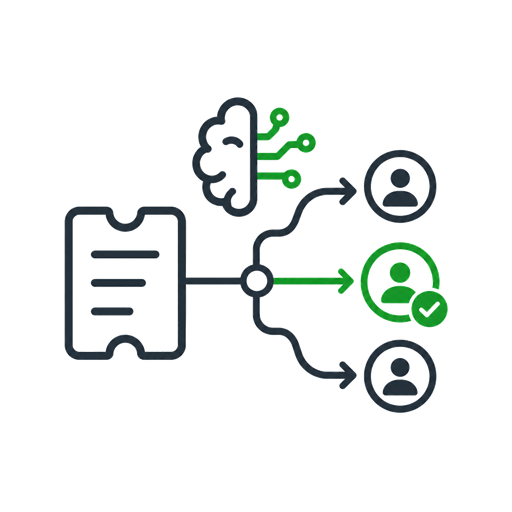

# Atribuição Inteligente

<p align="center">
  
</p>

Plugin GLPI para atribuição automática de chamados a técnicos por categoria/grupo, com suporte a indisponibilidade e escala de atendimento de técnicos.

## Base

- GLPI 10.0.x, com foco em GLPI 10.0.25.
- Fork standalone baseado no módulo **SmartAssign** do plugin **NexTool Solutions**.
- Autor deste fork: **Fabio Neres**.
- Licença: GPLv3+.
- Versão atual: **1.1.4**.

## Referências

Este fork preserva a lógica principal do SmartAssign/NexTool para distribuição por balanceamento ou rodízio, adaptando-a para um plugin GLPI independente chamado `atribuicaointeligente`.

Referência original:

- NexTool Solutions / SmartAssign, por Richard Loureiro / RPGMais.
- Repositório público de referência: https://github.com/RPGMais/nextool

## Instalação

Copie a pasta `atribuicaointeligente` para o diretório `plugins` do GLPI:

```text
GLPI_ROOT/plugins/atribuicaointeligente
```

Depois acesse **Configurar > Plugins**, instale e ative o plugin **Atribuição Inteligente**.

## Permissões

O plugin cria o direito `plugin_atribuicaointeligente` em **Administração > Perfis > Atribuição Inteligente**.

- `Ler`: acessa as telas e logs do plugin.
- `Criar`: adiciona indisponibilidades e escalas de atendimento.
- `Atualizar`: altera configurações, categorias, indisponibilidades e escalas de atendimento.
- `Excluir/Purgar`: remove indisponibilidades e escalas de atendimento.

## Recursos

Consulte tambem o [ROADMAP.md](ROADMAP.md) para evolucoes planejadas.

- Atribuição automática por balanceamento.
- Atribuição automática por rodízio.
- Opção para atribuir também o grupo encarregado da categoria.
- Opção para ignorar gerentes do grupo.
- Cadastro de indisponibilidade de técnicos:
  - férias por período;
  - ausência em data específica;
  - indisponibilidade recorrente por dia da semana;
  - ausência temporária com data inicial e final.
- Cadastro de escala de atendimento por técnico:
  - múltiplos dias da semana no mesmo cadastro;
  - horário inicial e final;
  - validade opcional por período;
  - escopo global ou por entidade.
- Log de decisões de atribuição com técnico escolhido e técnicos ignorados.
- Opção para respeitar o calendário de atendimento da entidade; entidades sem calendário continuam em modo 24/7.
- Bloqueio server-side para impedir gravações diretas de técnicos indisponíveis em atribuições manuais.
- Categorias novas entram inativas por padrão, para que a atribuição automática seja habilitada somente onde desejado.

## Observação sobre migração

Ao instalar, o plugin tenta copiar configurações e categorias do SmartAssign/NexTool se as tabelas originais existirem. Nenhuma tabela nativa do GLPI é alterada.
