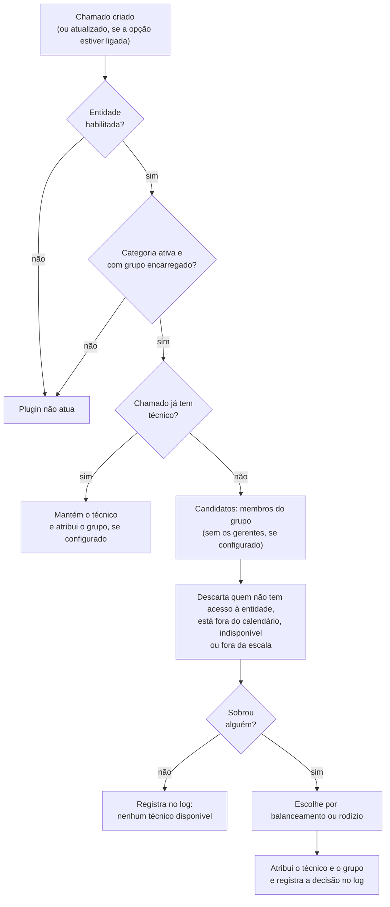

# Atribuição Inteligente

  

Plugin GLPI que distribui chamados automaticamente entre os técnicos do grupo
responsável pela categoria, por balanceamento de carga ou rodízio, respeitando
férias, ausências, escala de atendimento e o calendário da entidade.

> ### ⚠️ Compatibilidade: somente GLPI 10.0.x
>
> Esta versão funciona **exclusivamente** em **GLPI 10.0.0 a 10.0.99**.
>
> O plugin declara esse limite em `setup.php` e o GLPI **recusa a instalação**
> fora dessa faixa. **Não instale em GLPI 11** — a versão para GLPI 11 é
> mantida em linha separada e ainda não foi publicada.

## Funcionalidades

**Distribuição automática**

- Dois modos: **balanceamento**, que escolhe quem tem menos chamados em aberto, e
  **rodízio**, que alterna entre os membros do grupo.
- Distribuição por grupo ou por categoria.
- Opção para atribuir também o grupo encarregado da categoria.
- Opção para ignorar quem está marcado como **Gerente** no grupo.
- Opção para distribuir também ao atualizar um chamado que ainda não tem técnico.
- Opção para distribuir apenas dentro do calendário de atendimento da entidade;
  entidades sem calendário seguem em modo 24/7.

**Disponibilidade dos técnicos**

- Indisponibilidades: férias por período, ausência temporária, ausência em data
  específica e indisponibilidade recorrente por dia da semana. Sem horário
  informado, o período vale pelo dia inteiro.
- Até 3 períodos de férias por ano, em até 2 anos, por técnico, com visão de
  próximas férias e férias simultâneas.
- Escala de atendimento por técnico, com vários dias da semana, horário, validade
  opcional e escopo global ou por entidade. Técnico sem escala ativa continua
  disponível.
- Bloqueio da atribuição manual de técnico indisponível.

**Controle**

- Habilitação por entidade: novas entidades entram desligadas e só recebem
  distribuição onde forem habilitadas.
- Categorias novas entram inativas, para que a distribuição seja ligada só onde
  for desejada.
- Técnico sem acesso à entidade do chamado não é escolhido.

**Auditoria e relatórios**

- Log de decisões com o técnico escolhido e o motivo de cada técnico ignorado,
  aberto por padrão só com a atuação do plugin.
- Relatório de distribuições com filtros por período, entidade, categoria, origem
  e ação; classificação em automação integral, automação parcial e atuação
  manual; rankings, distribuição por categoria, transferências entre entidades e
  gráficos configuráveis por bloco.

## Como funciona

Quando um chamado é criado, o plugin decide assim:

```mermaid
flowchart TD
    A["Chamado criado<br>(ou atualizado, se a opção estiver ligada)"] --> B{"Entidade<br>habilitada?"}
    B -- não --> X["Plugin não atua"]
    B -- sim --> C{"Categoria ativa e<br>com grupo encarregado?"}
    C -- não --> X
    C -- sim --> D{"Chamado já tem<br>técnico?"}
    D -- sim --> Y["Mantém o técnico<br>e atribui o grupo, se configurado"]
    D -- não --> E["Candidatos: membros do grupo<br>(sem os gerentes, se configurado)"]
    E --> F["Descarta quem não tem acesso à entidade,<br>está fora do calendário, indisponível<br>ou fora da escala"]
    F --> G{"Sobrou<br>alguém?"}
    G -- não --> L["Registra no log:<br>nenhum técnico disponível"]
    G -- sim --> H["Escolhe por balanceamento ou rodízio"]
    H --> K["Atribui o técnico e o grupo<br>e registra a decisão no log"]
```

Cada decisão, inclusive quando ninguém pôde ser escolhido, fica registrada na aba
**Logs** com o motivo de cada técnico descartado.

## Compatibilidade

- GLPI: **10.0.0 a 10.0.99** (validado em 10.0.25). Não compatível com GLPI 11.
- PHP: 7.4 ou superior.

## Instalação

1. Copie a pasta `atribuicaointeligente` para `GLPI_ROOT/plugins/`.
2. Em **Configurar > Plugins**, instale e ative o plugin **Atribuição Inteligente**.
3. O direito do plugin é concedido automaticamente aos perfis que administram a
   configuração do GLPI. Para outros perfis, conceda em **Administração > Perfis**.
4. Na configuração do plugin, habilite as entidades e as categorias que devem
   receber distribuição.

Ao instalar, o plugin tenta copiar configurações e categorias do
SmartAssign/NexTool, se as tabelas originais existirem.

O histórico de versões está no [CHANGELOG.md](CHANGELOG.md).

## Permissões

O plugin cria o direito `plugin_atribuicaointeligente` em
**Administração > Perfis > Atribuição Inteligente**.

- `Ler`: acessa as telas e logs do plugin.
- `Criar`: adiciona indisponibilidades e escalas de atendimento.
- `Atualizar`: altera configurações, categorias, indisponibilidades e escalas.
- `Excluir/Purgar`: remove indisponibilidades e escalas.

Perfis com o direito restrito a uma subentidade só gravam dentro das próprias
entidades; registros globais ficam visíveis, sem edição.

## Escrita em tabelas nativas

O plugin usa tabelas próprias para sua configuração e seus registros. Há duas
exceções, ambas intencionais e restritas:

- a ação em massa **Alterar grupo responsável**, na aba Categorias, grava
  `groups_id` em `glpi_itilcategories`, e exige acesso direto à entidade da
  categoria e um grupo válido para essa entidade;
- a distribuição automática cria os atores do chamado (`glpi_tickets_users` e
  `glpi_groups_tickets`) pelas APIs do GLPI e muda o status de `Novo` para
  `Atribuído`, como faria uma atribuição manual.

## Suporte e contato

- Repositório: [github.com/fabioneres/glpi-atribuicaointeligente](https://github.com/fabioneres/glpi-atribuicaointeligente)
- Dúvidas, problemas e sugestões: [GitHub Issues](https://github.com/fabioneres/glpi-atribuicaointeligente/issues)
- Autor: Fabio Neres
- Licença: [GPLv3+](https://www.gnu.org/licenses/gpl-3.0.html)
