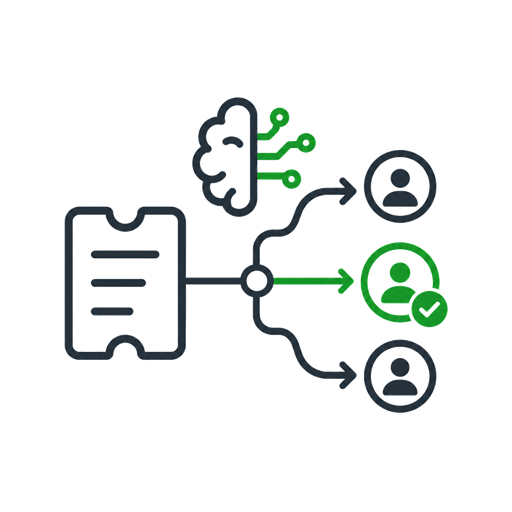

# Atribuição Inteligente

<p align="center">
  
</p>

<p align="center">
  
  
  
</p>

Plugin GLPI para atribuição automática de chamados a técnicos por categoria/grupo, com suporte a indisponibilidade e escala de atendimento de técnicos.

> ### ⚠️ Compatibilidade: somente GLPI 10.0.x
>
> Esta versão funciona **exclusivamente** em **GLPI 10.0.0 a 10.0.99**.
>
> O plugin declara esse limite em `setup.php` e o GLPI **recusa a instalação**
> fora dessa faixa. **Não instale em GLPI 11** — a versão para GLPI 11 é
> mantida em linha separada e ainda não foi publicada.

## Base

- **GLPI 10.0.x apenas** (testado em GLPI 10.0.25). Não compatível com GLPI 11.
- PHP 7.4+.
- Fork standalone baseado no módulo **SmartAssign** do plugin **NexTool Solutions**.
- Autor deste fork: **Fabio Neres**.
- Licença: GPLv3+.
- Versão atual: **1.3.2**.

## Referências

Este fork preserva a lógica principal do SmartAssign/NexTool para distribuição por balanceamento ou rodízio, adaptando-a para um plugin GLPI independente chamado `atribuicaointeligente`.

Referência original:

- NexTool Solutions / SmartAssign, por Richard Loureiro / RPGMais.
- Repositório público de referência: https://github.com/RPGMais/nextool

## Instalação

Copie a pasta `atribuicaointeligente` para o diretório `plugins` do GLPI:

```text
GLPI_ROOT/plugins/atribuicaointeligente
```

Depois acesse **Configurar > Plugins**, instale e ative o plugin **Atribuição Inteligente**.

## Permissões

O plugin cria o direito `plugin_atribuicaointeligente` em **Administração > Perfis > Atribuição Inteligente**.

- `Ler`: acessa as telas e logs do plugin.
- `Criar`: adiciona indisponibilidades e escalas de atendimento.
- `Atualizar`: altera configurações, categorias, indisponibilidades e escalas de atendimento.
- `Excluir/Purgar`: remove indisponibilidades e escalas de atendimento.

## Recursos

Consulte tambem:

- [ROADMAP.md](ROADMAP.md) para evolucoes planejadas;
- [docs/README.md](docs/README.md) para o indice da documentacao;
- [docs/HISTORICO.md](docs/HISTORICO.md) para o historico resumido;
- [docs/RELATORIO_TECNICO.md](docs/RELATORIO_TECNICO.md) para o relatorio tecnico consolidado;
- [../../../docs/licoes-aprendidas/README.md](../../../docs/licoes-aprendidas/README.md) para licoes aprendidas globais do workspace;
- [docs/ANTIPADROES.md](docs/ANTIPADROES.md) para antipadroes observados e evitados;
- [docs/CHECKLIST_DOCUMENTACAO_GLPI10.md](docs/CHECKLIST_DOCUMENTACAO_GLPI10.md) para a conformidade documental com a skill GLPI 10.

- Atribuição automática por balanceamento.
- Atribuição automática por rodízio.
- Opção para atribuir também o grupo encarregado da categoria.
- Opção para ignorar gerentes do grupo.
- Cadastro de indisponibilidade de técnicos:
  - férias por período;
  - ausência em data específica;
  - indisponibilidade recorrente por dia da semana;
  - ausência temporária com data inicial e final.
- Visualização de indisponibilidades separada por abas de férias, ausência temporária e outras ausências, com consulta de próximos períodos de férias e férias simultâneas.
- Ao cadastrar indisponibilidade sem informar horário, o período é tratado como dia inteiro: início em `00:00:00` e fim em `23:59:59`.
- Férias exibem períodos no formato `DD-MM-AAAA`, sem horário, com próximas férias limitadas ao mês atual e ao próximo; no detalhe do técnico, a coluna de ações permite editar cada período quando o usuário tem permissão.
- Cada técnico pode ter no máximo 2 anos/cadastros de férias, com até 3 períodos por ano, totalizando até 6 períodos.
- Cadastro de escala de atendimento por técnico:
  - múltiplos dias da semana no mesmo cadastro;
  - horário inicial e final;
  - validade opcional por período;
  - escopo global ou por entidade.
- Log de decisões de atribuição com técnico escolhido e técnicos ignorados.
- Relatorio de distribuicoes com filtros simplificados por periodo, entidade, categoria, origem e tipo de acao, classificacao gerencial em Automacao integral, Automacao parcial e Atuacao manual, KPIs, rankings por chamados, distribuicao por categoria, transferencias por entidade e graficos configuraveis por bloco.
- Cada bloco grafico do relatorio permite escolher tipo de visualizacao, limite de dados, rotulos, fundo e cor principal, mantendo paleta automatica quando a cor fica vazia.
- Habilitacao do plugin por entidade, com reducao de logs e processamento fora do escopo desejado.
- Entidades entram inativas por padrao em instalacoes novas; habilite manualmente apenas as entidades desejadas.
- Acoes rapidas para habilitar ou desabilitar todas as entidades visiveis de uma vez.
- Paginacao na tela de logs para evitar carregamento excessivo.
- Opção para respeitar o calendário de atendimento da entidade; entidades sem calendário continuam em modo 24/7.
- Opcao para atribuir chamados tambem ao atualizar, usando somente categorias ativas e apenas quando o chamado ainda nao possui tecnico.
- Bloqueio server-side para impedir gravações diretas de técnicos indisponíveis em atribuições manuais.
- Categorias novas entram inativas por padrão, para que a atribuição automática seja habilitada somente onde desejado.

## Observação sobre migração

Ao instalar, o plugin tenta copiar configurações e categorias do SmartAssign/NexTool se as tabelas originais existirem.

## Escrita em tabelas nativas

O plugin usa tabelas próprias para sua configuração e seus registros. Há duas
exceções, ambas intencionais e restritas:

- a ação em massa **Alterar grupo responsável**, na aba Categorias, grava
  `groups_id` em `glpi_itilcategories`. A partir da 1.3.2 ela exige acesso
  direto à entidade da categoria e um grupo válido para essa entidade;
- a atribuição automática cria atores do chamado (`glpi_tickets_users` e
  `glpi_groups_tickets`) pelas APIs do GLPI e muda o status de `Novo` para
  `Atribuído`, como faria uma atribuição manual.

## Atualização para a 1.3.2

A 1.3.2 é uma release de segurança. Dois ajustes apertam permissões e mudam
comportamento visível para perfis com o direito do plugin **restrito a uma
subentidade**:

1. Não é mais possível criar, editar ou excluir indisponibilidade e escala com
   entidade **Todas / global**, nem de entidade ancestral. Esses registros
   continuam visíveis na listagem, mas sem botão de edição.
2. A aba Categorias passa a listar apenas regras das entidades visíveis, e a
   ação em massa exige acesso direto à entidade da categoria.

Quem administra a partir da entidade raiz não é afetado. O detalhamento está em
[docs/HISTORICO.md](docs/HISTORICO.md).
